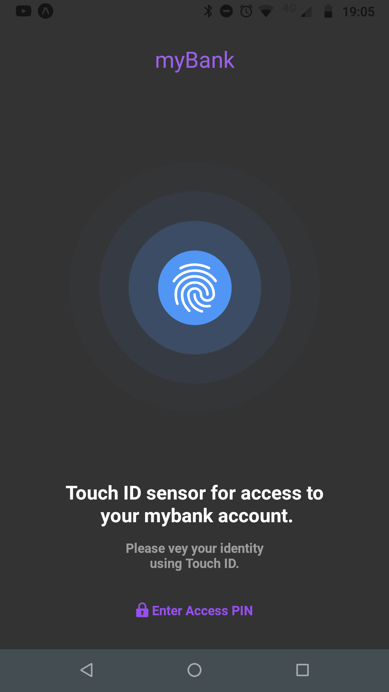
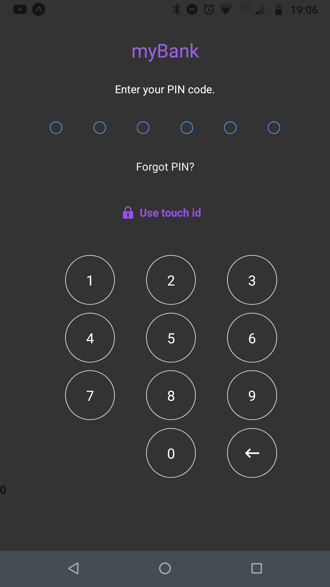
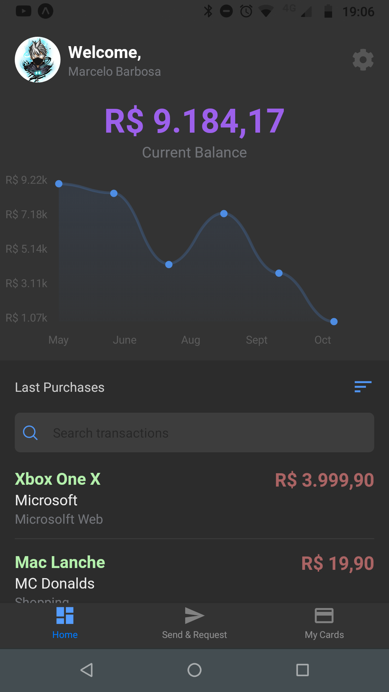
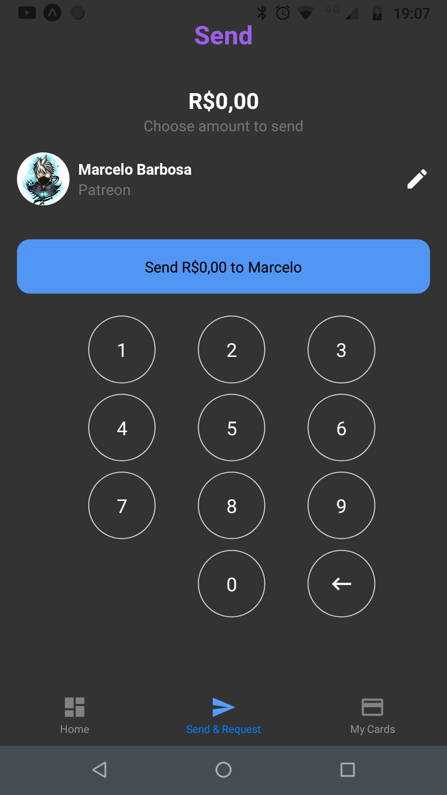
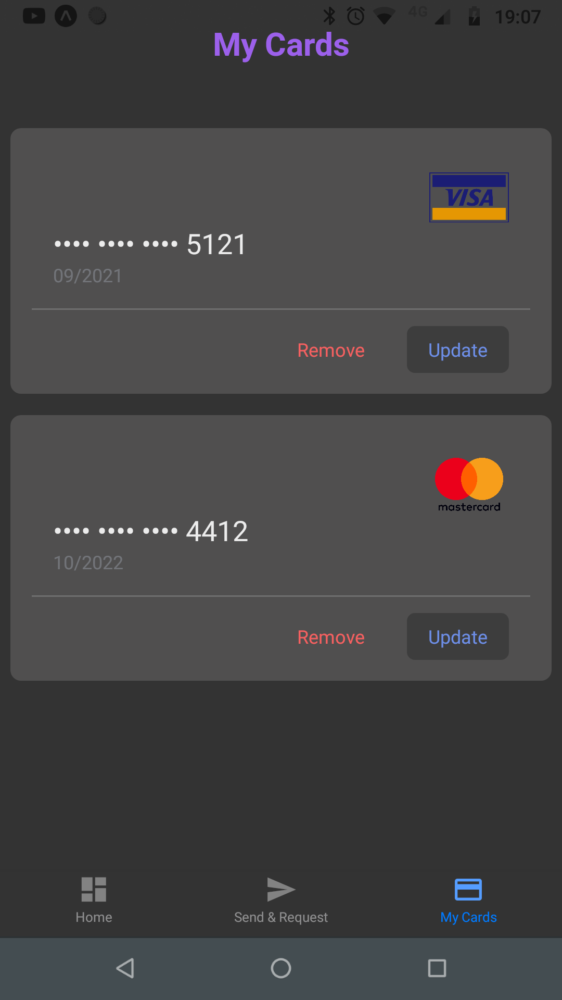

# My Wallet

  
  

## Prints

## Short description

The goal is to help the user get a quick glimpse of their spending summary.

## 💻 Project

Redux Saga will also be inserted to manage the state of the application. A backend will be built in NodeJS with Express to manage user authentication, categories, store user data in general.

## Dribbble Inspiration

https://dribbble.com/shots/12553201-Wallet-App

## 🚀 Technology

This project was developed with the following technologies:

- [Node.js] (https://nodejs.org/en/)
- [TypeScript] (https://www.typescriptlang.org/)
- [Expo] (https://expo.io/)

## Starting

1. Clone this repo using `git clone git@githubcom:marceloppb/My_Wallet.git`
2. Move to the appropriate directory: `cd My_Wallet`  
3. Run `yarn` to install dependencies  
4. Run `yarn start` to start locally  

## Licença

Este projeto está licenciado sob a Licença MIT - consulte a página [LICENSE] (https://opensource.org/licenses/MIT) para obter detalhes
